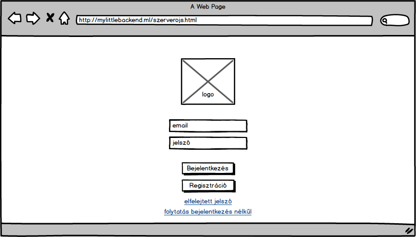

# Online képgaléria

Szerver oldali JavaScript házi feladat specifikáció

## Ötlet

A feladat egy Instagramhoz hasonló online képgaléria megvalósítása. Képeket lehet feltölteni melyek más felhasználók megtekinthetnek, kedvelhetnek és kommentelhetnek. Különbség, hogy a felhasználók albumokra bonthatják a képeiket.

## Követelmények

* háromszintű felhasználó kezelés: 
  * regisztrálatlan felhasználó (látogató), 
  * regisztrált felhasználó (felhasználó),
  * admin
* látogatók megtekinthet más felhasználók nyilvános albumait
*  regisztrált felhasználók:
  * rendelkeznek azokkal a jogokkal amikkel a látogatók is
  * kedvelhetik (illetve kikedvelhetik) mások képeit
  * kommentelhetnek (illetve törölhetik saját kommentjüket) egy kép alatt
  * rendelkeznek (szerkezthető) profillal, ahol az adott felhasználó által látható galériák jelennek meg, bennük a képekkel 
  * profiloldal tartalmaz: felhasználónevet, profilképet, kedvelések számát
* regisztrált felhasználók továbbá létrehozhatnak saját albumokat, ezekhez képeket tölthetnek fel
  * az albumok lehetnek rejtettek, illetve nyilvánosak. Ha egy album rejtett, akkor mások nem láthatják azt, csak az admin
  * albumokba képeket tölthetnek fel
  * ezeket tetszőlegesen szerkezthetik vagy törölhetik utólag
* adminok:
  * rendelkeznek azokkal a jogokkal amikkel a regisztrált felhasználók is
  * megtekintheti mindenkinek a privát albumát
  * törölheti bárkinek a privát albumát

## Megvalósítás

### Entitások

### Nézetek

### További ötletek

* Albumokhoz tag rendelés és az alapján keresés
